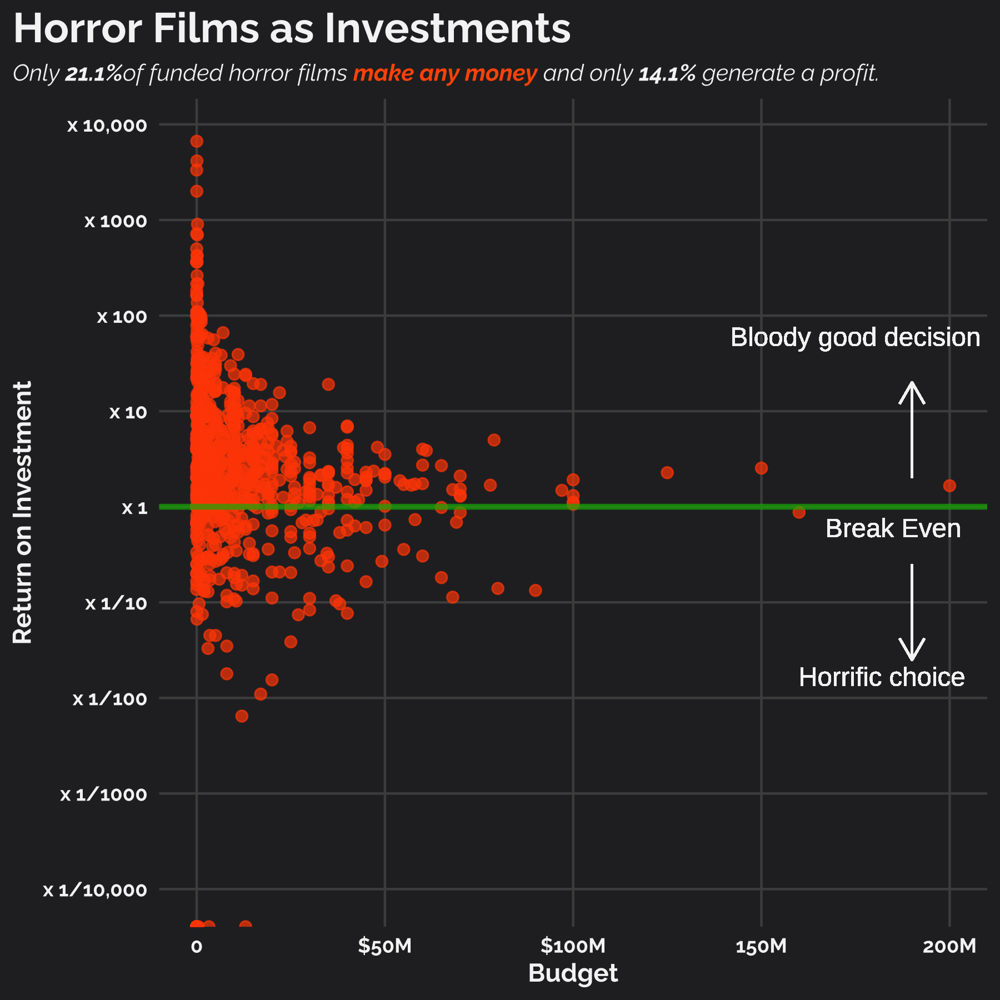

# Tidy Tuesday 2022-11-01

## Horror Films

This week's data set was provided by Tanya Shapiro (\@tanya_shapiro) based on her recent [workshop](https://github.com/tashapiro/horror-movies).

I investigated the link between the `budget` and the `revenue` of horror films, through the *return on investment:*

$$ \text{ROI} = \frac{\text{Revenue} - \text{Initial Investment}}{ \text{Initial Investment}}.$$

ROI is a very heavy-tailed and so is tricky to visualise. To improve this, I focused in on the success stories and used a logarithmic y-axis.

Investing in high-budget films is likely to see more consistent returns. Investing in low-budget films, although more risky, can be a bloody good investment.

There were also a few films that were real stinkers, getting a budget of around \~\$5M and seeing only less than \$10K revenue.
