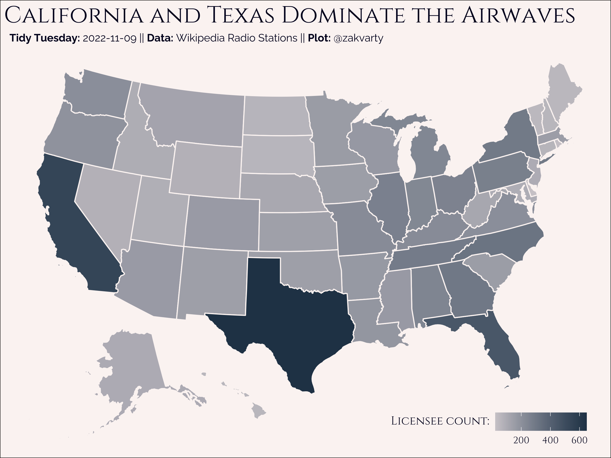

# Tidy Tuesday 2022-11-01

## USA Radio

### Data Source

This week's data set comes from the [Wikipedia](https://en.wikipedia.org/wiki/Lists_of_radio_stations_in_the_United_States) article on radio stations in the United States. See also [Erin's](https://twitter.com/erindataviz) blogpost on [Visualizing the Geography of FM Radio](https://erdavis.com/2020/01/04/visualizing-the-geography-of-fm-radio/) for much more creative visualisaitons. 

Data sourced from [FCC](https://www.fcc.gov/media/radio/fm-service-contour-data-points). Credit: [Frank Hull](twitter.com/frankiethull)

### Commentary 

I was a bit pressed for time this week and this is my first foray into mapping with ggplot. With that in mind, I kept the statistics minimal on this and focused on making something that (I find) visually appealing. 

New ggplot skills this week:

- Chloropleth mapping,
- Setting custom colour scales,
- Adjusting the location and orientation of the legend. 

### Plot 

