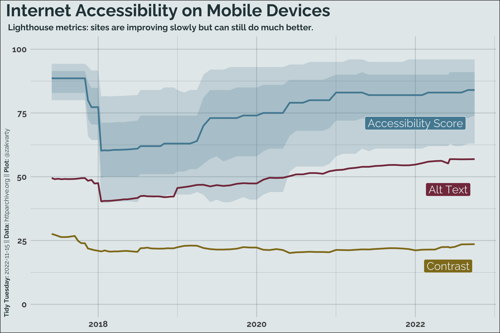

# Tidy Tuesday 2022-11-15

## Mobile Web Acessibility

### Data Source

This week's data set comes from [httparchive.org](https://httparchive.org/reports/loading-speed?start=earliest&end=latest&view=list) via [Data is Plural](https://www.data-is-plural.com/archive/2022-11-02-edition/) and has been featured in "[Why web pages can have a size problem](https://blog.datawrapper.de/why-web-pages-can-have-a-size-problem/)" (Datawrapper).

Full detail available via BigQuery, but aggregate data used for this week. Full data available via instructions at: <https://github.com/HTTPArchive/httparchive.org/blob/main/docs/gettingstarted_bigquery.md>

### Commentary

Another statistically minimal week because of time pressure.

Though there was also data on the sizes of webpages, I thought looking at the lighthouse accessibility metrics used by Google would be an interesting perspective, particularly for TidyTuesday folks who are interested in data visualisation.

I found it interesting to see the gradual increase in the use of alt-text over time and shocked that inaccessible colour schemes are still very common.

For more information on how the overall metric values are calculated, see the [Chrome Developer Docs on lighthouse accessibility scoring](https://developer.chrome.com/docs/lighthouse/accessibility/scoring/). While a useful metric, it of course is an oversimplification of a very complex topic. One critique can be found in this [blog post by the Bureau of Internet Accessibility](https://www.boia.org/blog/googles-lighthouse-accessibility-tests-are-helpful-but-not-perfect).

### Plot 

**Alt-text:** Multiple line plot showing 3 lighthouse web accessibility metrics between late 2017 and late 2022. Title reads "Internet Accessibility on Mobile Devices" with the subtitle "Lighthouse metrics: sites are improving slowly but can still do much better". The top line shows that the median accessibility score was increasing in the period 2018-2021, but has since levelled off. The middle line shows a slight gradual increase in the proportion of images with alt-text, which is now above 50%. The final line indicates that over the entire period only around 25% of websites use colour schemes with acceptable levels of contrast. 
