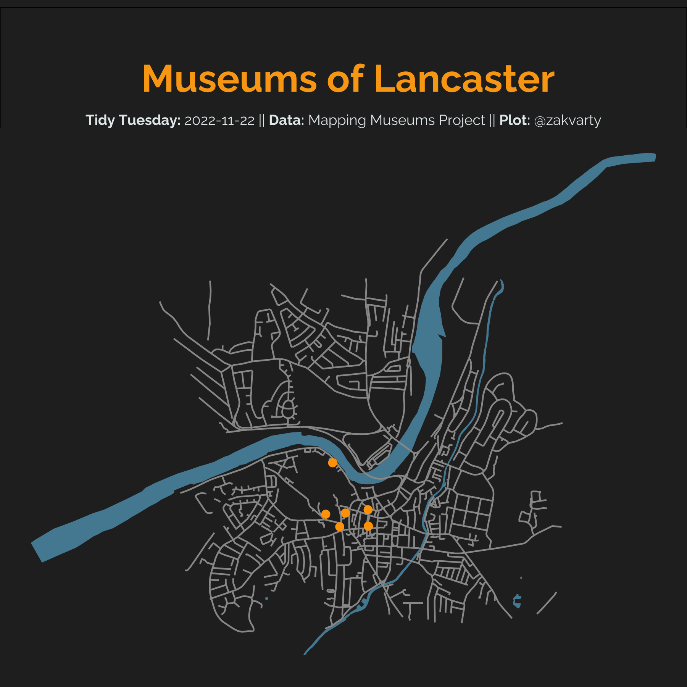

# Tidy Tuesday 2022-11-22

## UK Museums

### Data Source

The data this week comes from [Mapping Museums project](https://museweb.dcs.bbk.ac.uk/data).

> The project’s research team has gathered, cleansed, and codified data relating to over 4000 UK museums - almost double the number of museums covered in any previous survey. It covers the period from 1960 to date. The challenges we faced and the processes we adopted to collect, integrate, and cleanse the data are described in our publications
>
> The following files are available for download, which capture the status of the Mapping Museums database at the formal end of the project in September 2021:
>
> License: The above data is free to use under the terms of the Creative Commons (BY) license. This allows users to copy, distribute, remix, and build upon the research, so long the Mapping Museums team is credited with its original creation.
>
> Please use the following citation if you do download the data: Data downloaded from the Mapping Museums website at www.mappingmuseums.org, Accessed on 2022-11-22.
>
> Also, we would be very interested to know how you are using, or planning to use, this data. Please use the [Get in Touch](https://museweb.dcs.bbk.ac.uk/contact) link to tell us about your work.

Glossary of terms: https://museweb.dcs.bbk.ac.uk/glossary

Key findings: https://museweb.dcs.bbk.ac.uk/findings

### Commentary

This plot is inspired by @_jcken pointing out that there are 9 museums in Lancaster. One of these is a repeat but there are also a couple that I didn't know existed, despite living there for almost a decade.

Key: **Visited**, Not Visited, _Did Not Know Existed_.

1. _Lancaster Police Museum_
2. _Kings Own Royal Regiment Museum_
3. _Cottage Museum_
4. **Maritime Museum Lancaster**
5. **Lancaster City Art Gallery**
6. **Lancaster Maritime Museum**
7. **Lancaster Castle**
8. **Judges Lodgings**
9. **Lancaster City Museum**

This week I finally had to face up to mapping in R. I've wasted a lot of the time in the past dealing with awkward coordinate systems and shape files. I kept myself sane by learning from existing code from @nrennie35 to get roads and @_jcken for the water. Thank you both!

New skills this week:

- Mapping
- Open Street Maps

### Plot

**Alt-text:** Minimal, dark-themed map of Lancaster city centre, UK. The map shows the named roads as white lines and waterways in blue. Locations of museums are shown by orange dots.
