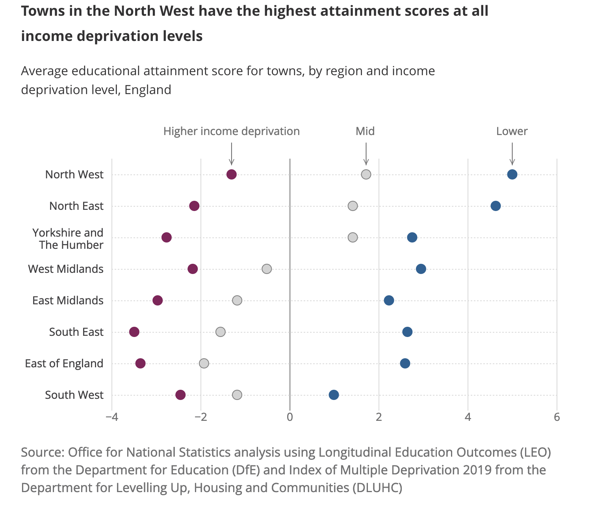
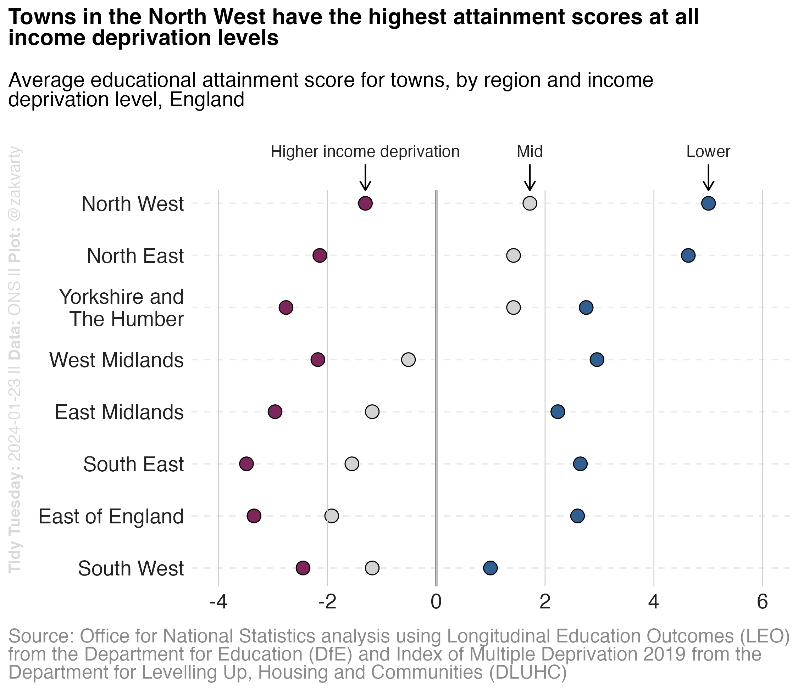
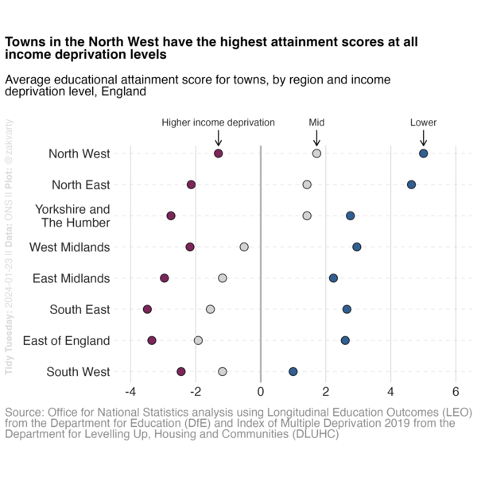

<h1 align="center"> English Education </h1>

## Summary

The [dataset](https://www.ons.gov.uk/file?uri=/peoplepopulationandcommunity/educationandchildcare/datasets/educationalattainmentofyoungpeopleinenglishtownsdata/200708201819/youngpeoplesattainmentintownsreferencetable1.xlsx) this week comes from [The UK Office for National Statistics](https://www.ons.gov.uk/).

It was explored in the July 2023 article ["Why do children and young people in smaller towns do better academically than those in larger towns?"](https://www.ons.gov.uk/peoplepopulationandcommunity/educationandchildcare/articles/whydochildrenandyoungpeopleinsmallertownsdobetteracademicallythanthoseinlargertowns/2023-07-25).
and was suggested by [Andrea Carpignani](https://github.com/acarpignani).

The article linked above contains several plots and I tried to reproduce the one shown below. 

  

## Visualisation

The reproduction in `{ggplot2}`:

  

## Recording

The making of this visualisation was recorded with the `{camcorder}` package.

  

## Walkthrough 

New to {ggplot2}? I made a set of [HTML slides](https://zakvarty.github.io/effective-data-science-resources/demo-classes/03-tidy-tuesday-walkthrough/tidy-tuesday.html#/title-slide) walking you through my development process.