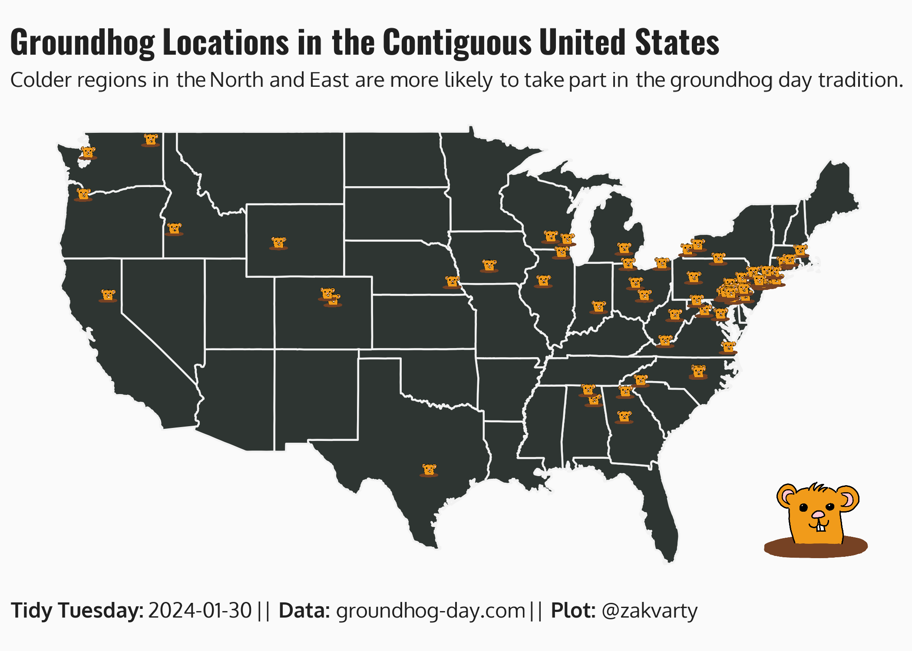
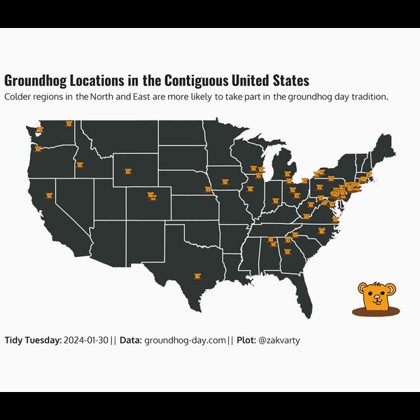

<h1 align="center"> Groundhog Day </h1>

## Summary

The dataset this week comes from [groundhog-day.com](https://www.groundhog-day.com/).

### What is Groundhog Day?

If you are not familiar with Groundhog day, [groundhog-day.com](https://www.groundhog-day.com/) descibes it as follows.

>Groundhog Day is a lighthearted holiday celebrated annually across North America in which ‘prognosticating’ animals predict the onset of spring.
>
>Traditionally, on February 2nd, various groundhogs across North America are consulted by local public figures (often a mayor) for an annual weather prediction:
>
> - If the groundhog ‘sees its shadow’, it means 6 more weeks of winter
> - If the groundhog doesn’t see its shadow, spring will come early
>
> Since groundhogs can’t speak English, they communicate their ‘prognostication’ in ‘Groundhogese’ — a language known only to specially-ordained groundhogs and the presiding officiant.
>
> Punxatawney Phil is the most famous prognosticating groundhog, largely due to starring the 1993 Hollywood film “Groundhog Day,” with Bill Murray in a supporting role. However, there are many Groundhog Day ceremonies across North America, not always strictly including a live groundhog, but all of which follow the central premise of an animal predicting the upcoming weather.
>
> So that’s Groundhog Day in a nutshell. However, if you’re a curious person or you’re not yet 100% clear on the scientific method used by groundhog forecasters, I would direct you to a more comprehensive history of Groundhog Day. It’s just as weird as you think.

## Visualisation

This week I decided to brush up my map plotting skills but showing the locations of all the prophetic groundhogs in the US. 

I also played around with adding images to `{ggplot2}` objects using `{ggimage}`. Honestly, I spent 80% of the time drawing the groundhog and 20% on adding it to the map. 

  

## Recording

The making of this visualisation was recorded with the `{camcorder}` package.

  

