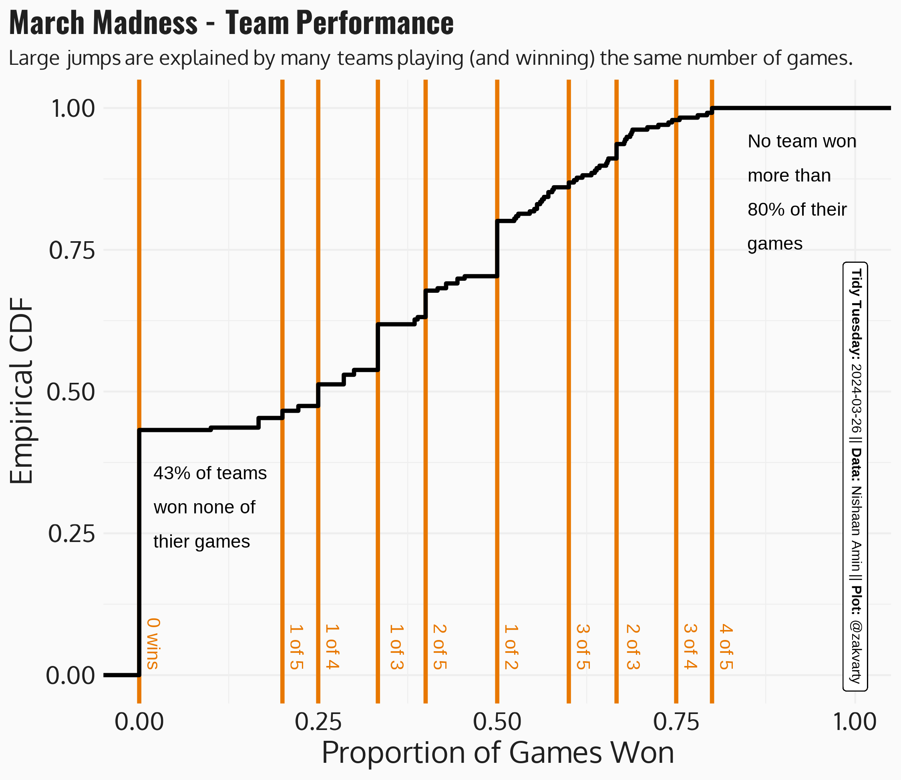
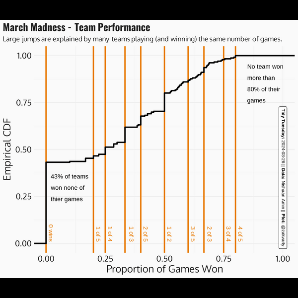

<h1 align="center"> March Madness </h1>

## Summary

This week's data is [NCAA Men's March Madness data](https://www.kaggle.com/datasets/nishaanamin/march-madness-data) from Nishaan Amin's Kaggle dataset and analysis [Bracketology: predicting March Madness](https://www.kaggle.com/code/nishaanamin/bracketology-predicting-march-madness).

## Visualisation

I don't know much about basketball so wanted to take a more statistical slant on this week's visualisation. I investigated the proportion of games won by each team. I was surprised by the unusual structure in the empirical CDF for the proportion of games won. After a little bit of further investigation, I realised this mixture of large and small steps was caused by the tournament structure. 

Many teams will play (and win) the same number of games, leading to "tall" steps where many teams have won the same proportion of games. 

Additionally, Teams who make it through more rounds will play more games and have more granular win proportions available to them. Progressing through rounds only happens by winning games, so the steps in the CDF become "narrower" as we move right, toward higher win proportions.

  

## Recording

The making of this visualisation was recorded with the `{camcorder}` package.

  

