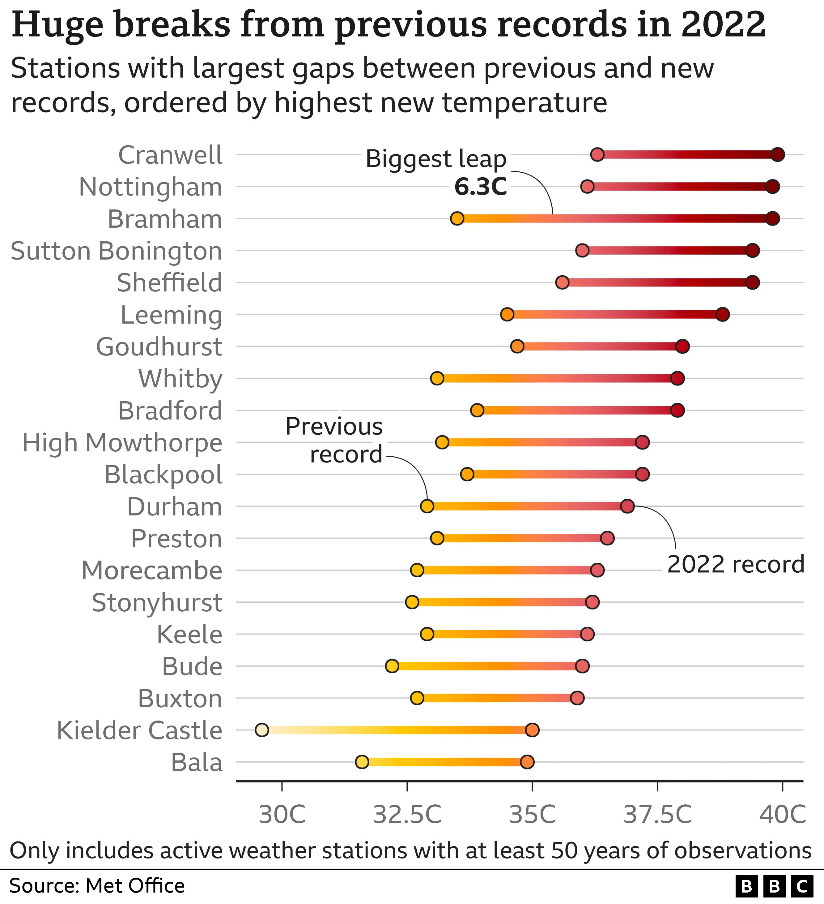
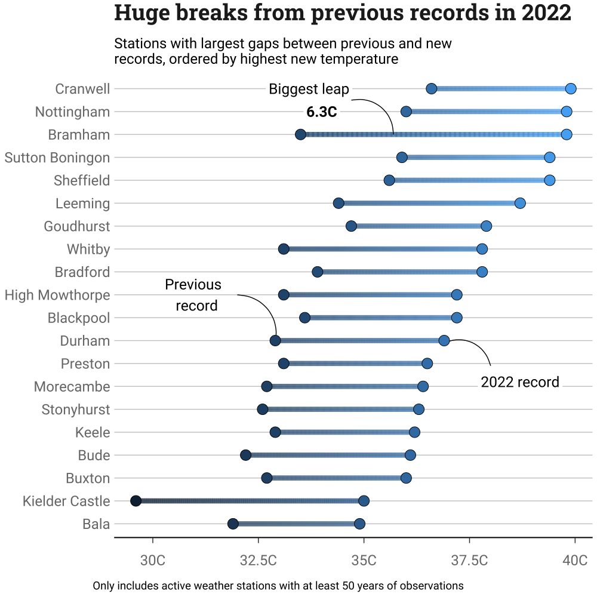

# BBC Temperature Records

On Friday 2022-10-14, the BBC Data Journalism Team released this excellent [article](https://www.bbc.co.uk/news/science-environment-63244353) about the record temperatures in the UK during this summer's heatwave. The article has some amazing data visualistions, and draws on a recent Met Office report.

I wanted to try and recreate one of the plots to test the limits of my ggplot knowledge. Since I had already tackled a stacked barplot, I figured I might have a go at their dumbbell plot that shows the weather stations which exeeded their previous records largest margins.

I couldn't find the data source, so spent __far__ too long with a printed copy of the original figure to make my own version of the data set. 

It took a while, but I got most of the way there with it and am happy with the final result. 

There were a few things that still have me stumped, that I might revisit at some later date: 

- [ ] Left aligning title and caption
- [ ] Using gradients on multiple parts of the plot
- [ ] Using the YeOrRd gradient, rather than default blues 
- [ ] Adding a non-BBC logo to the bottom right.

If anyone with superior ggplot skills would like to help with those or give pointers, then I would be most grateful.
